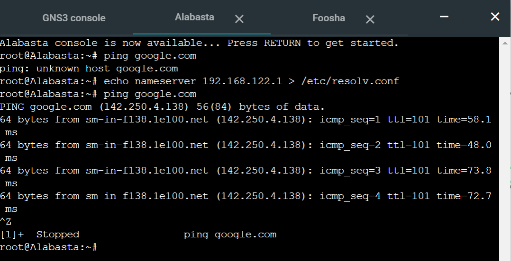
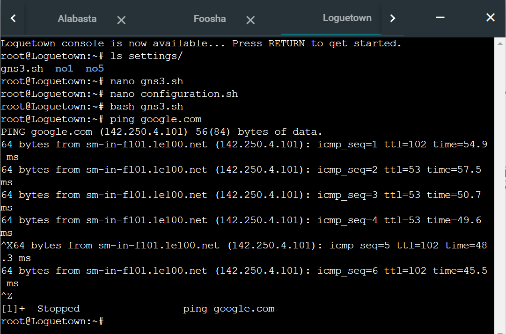

# Jarkom-Modul-2-E14-2021

**Anggota kelompok**:

- Dwi Wahyu Santoso (05111840000121)
- Khaela Fortunela (05111940000057)
- Husin Muhammad Assegaff (05111940000127)

---

## Tabel Konten

A. Jawaban

- [Soal 1](#soal-1)
- [Soal 2](#soal-2)
- [Soal 3](#soal-3)
- [Soal 4](#soal-4)
- [Soal 5](#soal-5)
- [Soal 6](#soal-6)
- [Soal 7](#soal-7)
- [Soal 8](#soal-8)
- [Soal 9](#soal-9)
- [Soal 10](#soal-10)
- [Soal 11](#soal-11)
- [Soal 12](#soal-12)
- [Soal 13](#soal-13)
- [Soal 14](#soal-14)
- [Soal 15](#soal-15)
- [Soal 16](#soal-16)
- [Soal 17](#soal-17)

B. Kendala

- [Kendala](#kendala)

---

## Prefix IP

Prefix IP Address kelompok kami adalah `10.36`

## Soal 1

EniesLobby akan dijadikan sebagai DNS Master, Water7 akan dijadikan DNS Slave, dan Skypie akan digunakan sebagai Web Server. Terdapat 2 Client yaitu Loguetown, dan Alabasta. Semua node terhubung pada router Foosha, sehingga dapat mengakses internet


**Pembahasan:**

1. Pertama, menambahkan host, switch, router, dan NAT yang diperlukan sesuai gambar di atas
2. Kemudian, setiap node saling dihubungkan menggunakan fitur **Add a link** yang sudah tersedia
3. Setelah itu, melakukan setting network pada setiap node dengan menggunakan fitur **edit network configuration**. Setting yang sudah ada digantikan dengan setting berikut ini, <br/>
   a. Foosha

   ```
   auto eth0
   iface eth0 inet dhcp

   auto eth1
   iface eth1 inet static
       address 10.36.1.1
       netmask 255.255.255.0

   auto eth2
   iface eth2 inet static
       address 10.36.2.1
       netmask 255.255.255.0
   ```

   b. Loguetown

   ```
   auto eth0
   iface eth0 inet static
       address 10.36.1.2
       netmask 255.255.255.0
       gateway 10.36.1.1
   ```

   c. Alabasta

   ```
   auto eth0
   iface eth0 inet static
       address 10.36.1.3
       netmask 255.255.255.0
       gateway 10.36.1.1
   ```

   d. EniesLobby

   ```
   auto eth0
   iface eth0 inet static
       address 10.36.2.2
       netmask 255.255.255.0
       gateway 10.36.2.1
   ```

   e. Water7

   ```
   auto eth0
   iface eth0 inet static
       address 10.36.2.3
       netmask 255.255.255.0
       gateway 10.36.2.1
   ```

   f. Skypie

   ```
   auto eth0
   iface eth0 inet static
       address 10.36.2.4
       netmask 255.255.255.0
       gateway 10.36.2.1
   ```

4. Setelah itu, restart semua node
5. Lalu, masukkan `iptables -t nat -A POSTROUTING -o eth0 -j MASQUERADE -s 10.36.0.0/16` pada console Foosha
6. Setelah itu, masukkan `echo nameserver 192.168.122.1 > /etc/resolv.conf` pada semua console node
7. Kemudian, dilakukan test ping google.com pada dua client tersebut <br/>
   a. Alabasta
   
   b. Loguetown
   

## Soal 2

Luffy ingin menghubungi Franky yang berada di EniesLobby dengan denden mushi. Kalian diminta Luffy untuk membuat website utama dengan mengakses franky.yyy.com dengan alias www.franky.yyy.com pada folder kaizoku

**Pembahasan:**

1. Membuka console EniesLobby, kemudian update package lists dengan perintah,
   ```
   apt-get update
   ```
2. Kemudian, install aplikasi bind9 dengan perintah,
   ```
   apt-get install bind9 -y
   ```
3. Setelah berhasil install, melakukan perintah berikut
   ```
    nano /etc/bind/named.conf.local
   ```
4. Dan mengisi konfigurasi **franky.e14.com** dengan sintaks berikut
   ```
   zone "franky.e14.com" {
       type master;
       file "/etc/bind/kaizoku/franky.e14.com";
   };
   ```
   
5. Kemudian membuat folder **kaizoku** pada /etc/bind
   ```
   mkdir /etc/bind/kaizoku
   ```
6. Copykan file db.local pada path /etc/bind ke dalam folder kaizoku yang baru saja dibuat dan ubah namanya menjadi franky.e14.com
   ```
   cp /etc/bind/db.local /etc/bind/kaizoku/franky.e14.com
   ```
7. Kemudian buka file franky.e14.com dan edit seperti gambar berikut
   ```
   nano /etc/bind/kaizoku/franky.e14.com
   ```
   
8. Lalu, restart bind9 dengan perintah
   ```
   service bind9 restart
   ```
9. Kemudian, pada file **/etc/resolv.conf** untuk node Alabasta dan Loguetown diganti menjadi IP EniesLobby
   ```
   nameserver 10.36.2.2 ;IP EniesLobby
   ```
10. Setelah itu, dilakukan test ping pada **franky.e14.com** dan **www.franky.e14.com** <br/>
    a. Alabasta
    
    b. Loguetown
    

## Soal 3

Setelah itu buat subdomain super.franky.yyy.com dengan alias www.super.franky.yyy.com yang diatur DNS nya di EniesLobby dan mengarah ke Skypie

**Pembahasan:**

1. Edit file **/etc/bind/kaizoku/franky.e14.com**, lalu tambahkan subdomain untuk franky.e14.com yang mengarah ke IP Skypie (10.36.2.4)
   
