# Jarkom-Modul-2-E14-2021

**Anggota kelompok**:

- Dwi Wahyu Santoso (05111840000121)
- Khaela Fortunela (05111940000057)
- Husin Muhammad Assegaff (05111940000127)

---

## Tabel Konten

A. Jawaban

- [Soal 1](#soal-1)
- [Soal 2](#soal-2)
- [Soal 3](#soal-3)
- [Soal 4](#soal-4)
- [Soal 5](#soal-5)
- [Soal 6](#soal-6)
- [Soal 7](#soal-7)
- [Soal 8](#soal-8)
- [Soal 9](#soal-9)
- [Soal 10](#soal-10)
- [Soal 11](#soal-11)
- [Soal 12](#soal-12)
- [Soal 13](#soal-13)
- [Soal 14](#soal-14)
- [Soal 15](#soal-15)
- [Soal 16](#soal-16)
- [Soal 17](#soal-17)

B. Kendala

- [Kendala](#kendala)

---

## Prefix IP

Prefix IP Address kelompok kami adalah `10.36`

## Soal 1

EniesLobby akan dijadikan sebagai DNS Master, Water7 akan dijadikan DNS Slave, dan Skypie akan digunakan sebagai Web Server. Terdapat 2 Client yaitu Loguetown, dan Alabasta. Semua node terhubung pada router Foosha, sehingga dapat mengakses internet
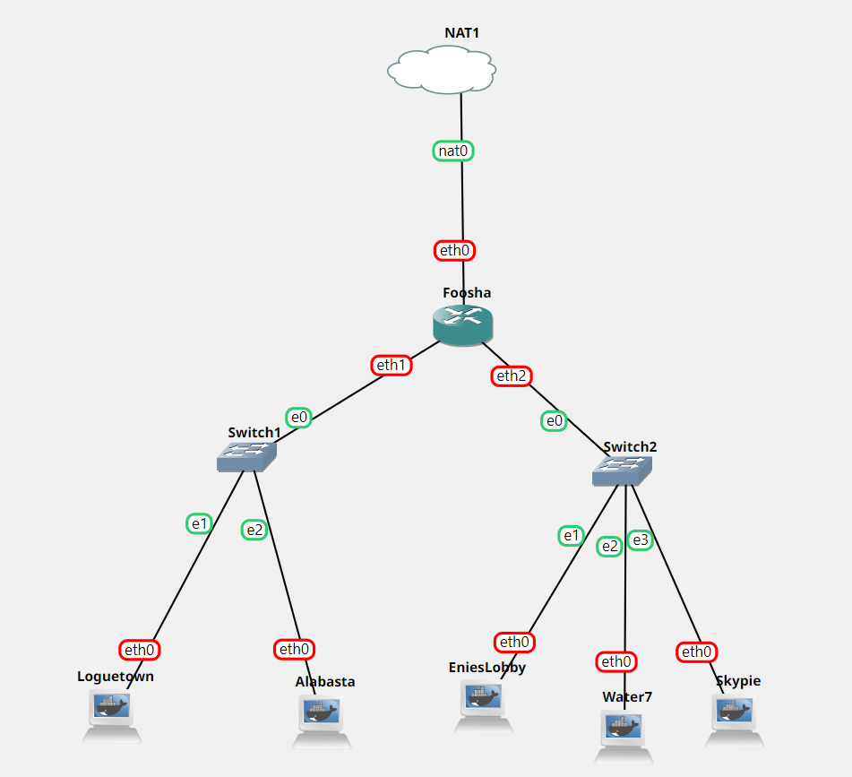

**Pembahasan:**

1. Pertama, menambahkan host, switch, router, dan NAT yang diperlukan sesuai gambar di atas
2. Kemudian, setiap node saling dihubungkan menggunakan fitur **Add a link** yang sudah tersedia
3. Setelah itu, melakukan setting network pada setiap node dengan menggunakan fitur **edit network configuration**. Setting yang sudah ada digantikan dengan setting berikut ini, <br/>
   a. Foosha

   ```
   auto eth0
   iface eth0 inet dhcp

   auto eth1
   iface eth1 inet static
       address 10.36.1.1
       netmask 255.255.255.0

   auto eth2
   iface eth2 inet static
       address 10.36.2.1
       netmask 255.255.255.0
   ```

   b. Loguetown

   ```
   auto eth0
   iface eth0 inet static
       address 10.36.1.2
       netmask 255.255.255.0
       gateway 10.36.1.1
   ```

   c. Alabasta

   ```
   auto eth0
   iface eth0 inet static
       address 10.36.1.3
       netmask 255.255.255.0
       gateway 10.36.1.1
   ```

   d. EniesLobby

   ```
   auto eth0
   iface eth0 inet static
       address 10.36.2.2
       netmask 255.255.255.0
       gateway 10.36.2.1
   ```

   e. Water7

   ```
   auto eth0
   iface eth0 inet static
       address 10.36.2.3
       netmask 255.255.255.0
       gateway 10.36.2.1
   ```

   f. Skypie

   ```
   auto eth0
   iface eth0 inet static
       address 10.36.2.4
       netmask 255.255.255.0
       gateway 10.36.2.1
   ```

4. Setelah itu, restart semua node
5. Lalu, masukkan `iptables -t nat -A POSTROUTING -o eth0 -j MASQUERADE -s 10.36.0.0/16` pada console Foosha
6. Setelah itu, masukkan `echo nameserver 192.168.122.1 > /etc/resolv.conf` pada semua console node
7. Kemudian, dilakukan test ping google.com pada dua client tersebut <br/>
   a. Alabasta
   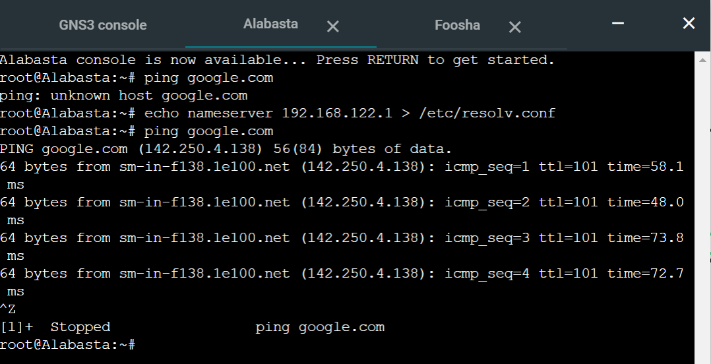
   b. Loguetown
   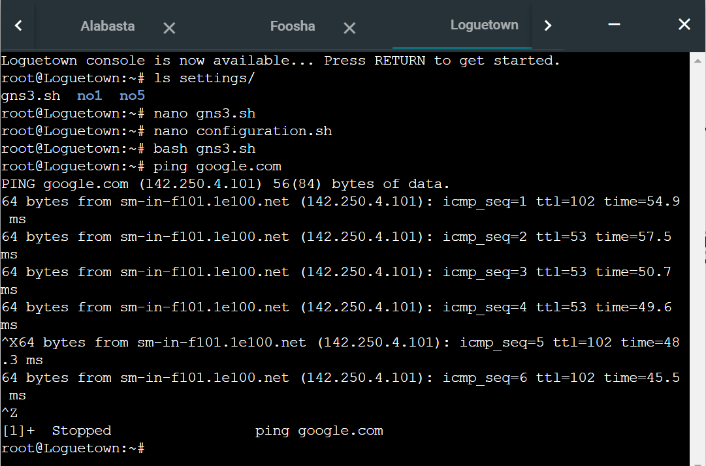

## Soal 2

Luffy ingin menghubungi Franky yang berada di EniesLobby dengan denden mushi. Kalian diminta Luffy untuk membuat website utama dengan mengakses franky.e14.com dengan alias www.franky.e14.com pada folder kaizoku

**Pembahasan:**

1. Membuka console EniesLobby, kemudian update package lists dengan perintah,
   ```
   apt-get update
   ```
2. Kemudian, install aplikasi bind9 dengan perintah,
   ```
   apt-get install bind9 -y
   ```
3. Setelah berhasil install, melakukan perintah berikut
   ```
    nano /etc/bind/named.conf.local
   ```
4. Dan mengisi konfigurasi **franky.e14.com** dengan sintaks berikut
   ```
   zone "franky.e14.com" {
       type master;
       file "/etc/bind/kaizoku/franky.e14.com";
   };
   ```
   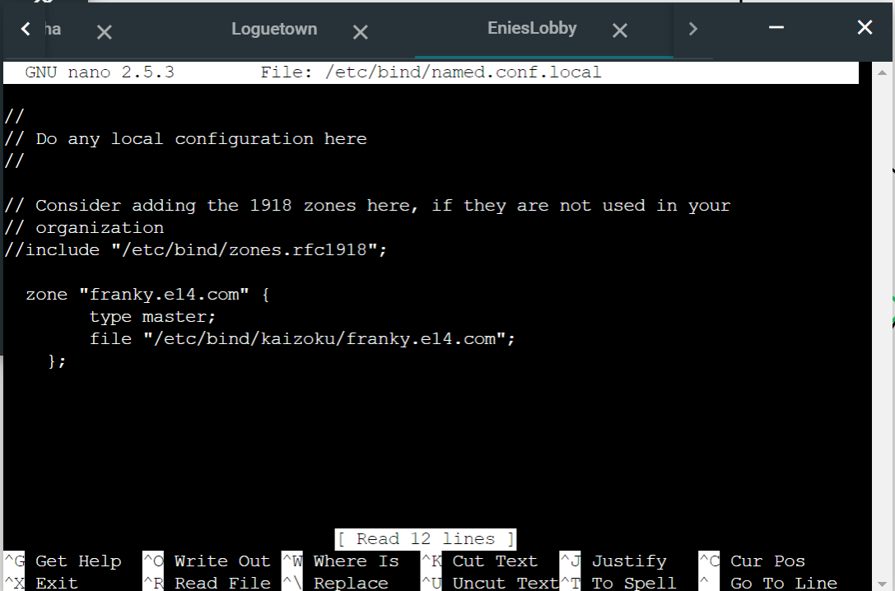
5. Kemudian membuat folder **kaizoku** pada /etc/bind
   ```
   mkdir /etc/bind/kaizoku
   ```
6. Copykan file db.local pada path /etc/bind ke dalam folder kaizoku yang baru saja dibuat dan ubah namanya menjadi franky.e14.com
   ```
   cp /etc/bind/db.local /etc/bind/kaizoku/franky.e14.com
   ```
7. Kemudian buka file franky.e14.com dan edit seperti gambar berikut
   ```
   nano /etc/bind/kaizoku/franky.e14.com
   ```
   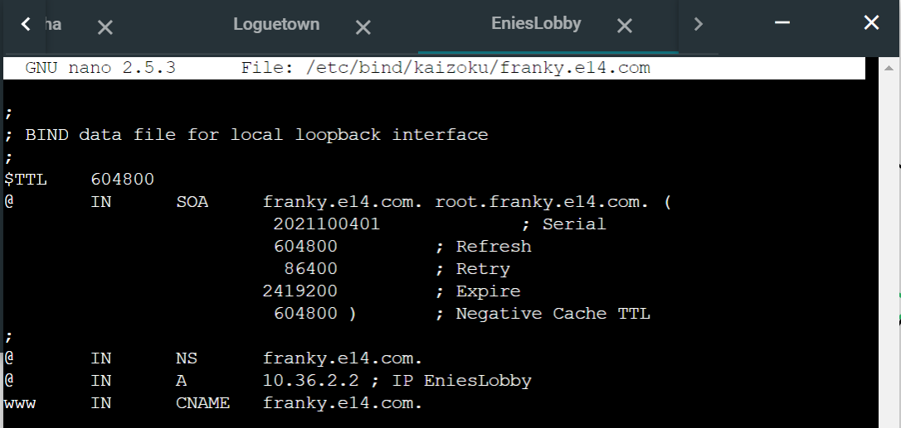
8. Lalu, restart bind9 dengan perintah
   ```
   service bind9 restart
   ```
9. Kemudian, pada file **/etc/resolv.conf** untuk node Alabasta dan Loguetown diganti menjadi IP EniesLobby
   ```
   nameserver 10.36.2.2 ;IP EniesLobby
   ```
10. Setelah itu, dilakukan test ping pada **franky.e14.com** dan **www.franky.e14.com** <br/>
    a. Alabasta
    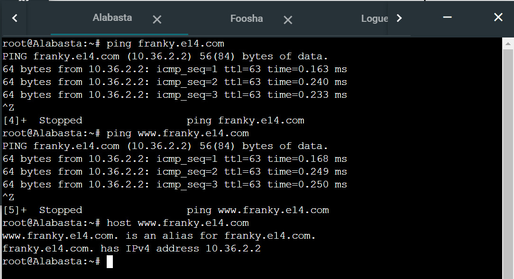
    b. Loguetown
    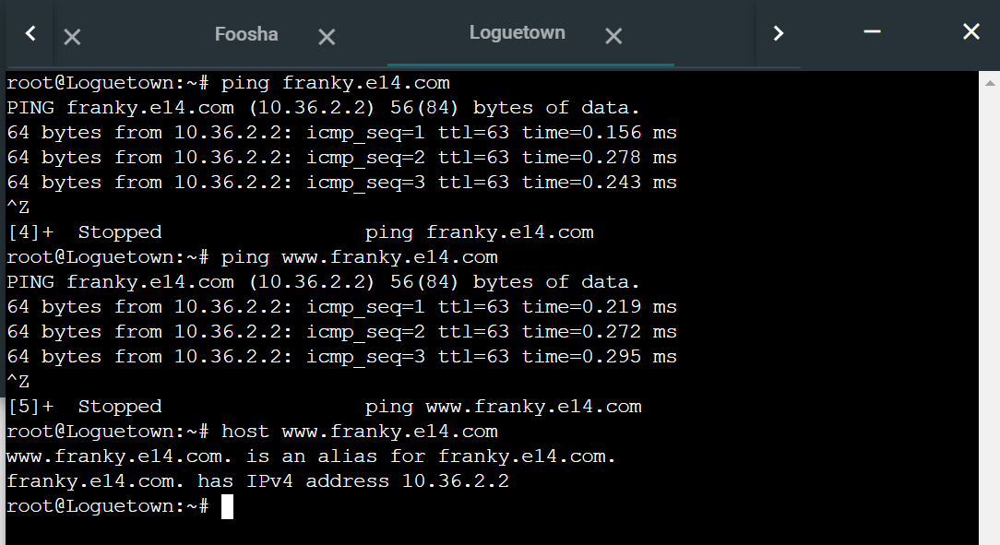

## Soal 3

Setelah itu buat subdomain super.franky.e14.com dengan alias www.super.franky.e14.com yang diatur DNS nya di EniesLobby dan mengarah ke Skypie

**Pembahasan:**

1. Edit file **/etc/bind/kaizoku/franky.e14.com**, lalu tambahkan subdomain untuk franky.e14.com yang mengarah ke IP Skypie (10.36.2.4)
   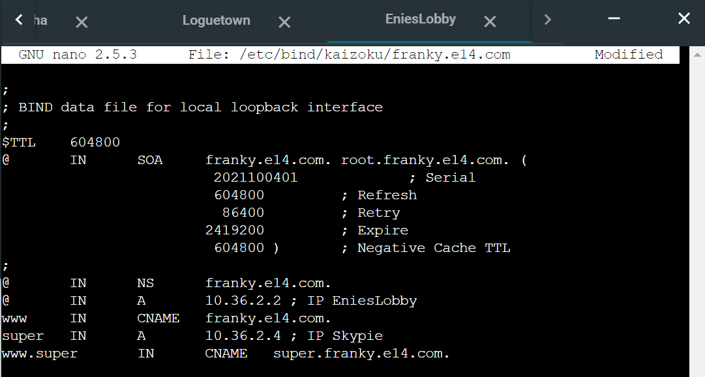
2. Restart service bind
   ```
   service bind9 restart
   ```
3. Lalu, dilakukan `ping super.franky.e14.com` dan `ping www.super.franky.e14.com` pada client Alabasta dan Loguetown <br/>
   a. Alabasta
   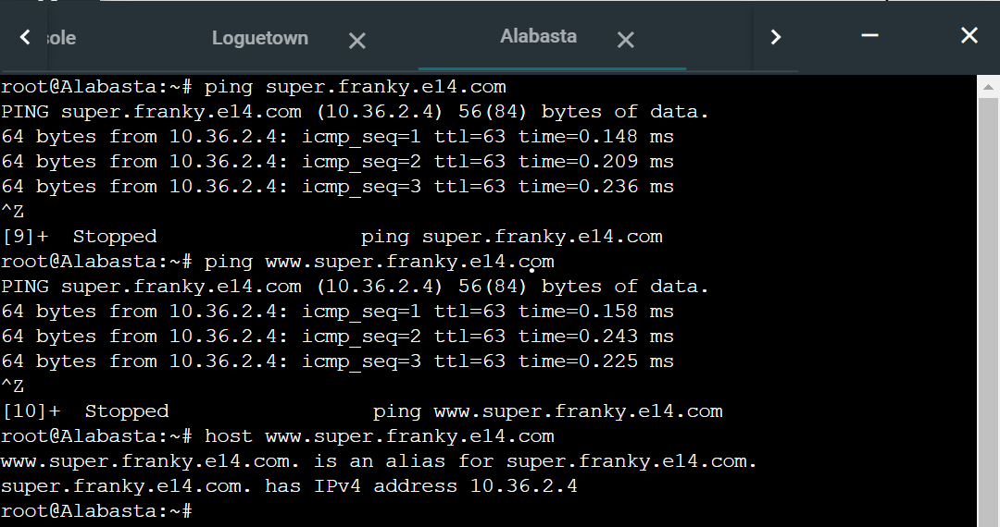
   b. Loguetown
   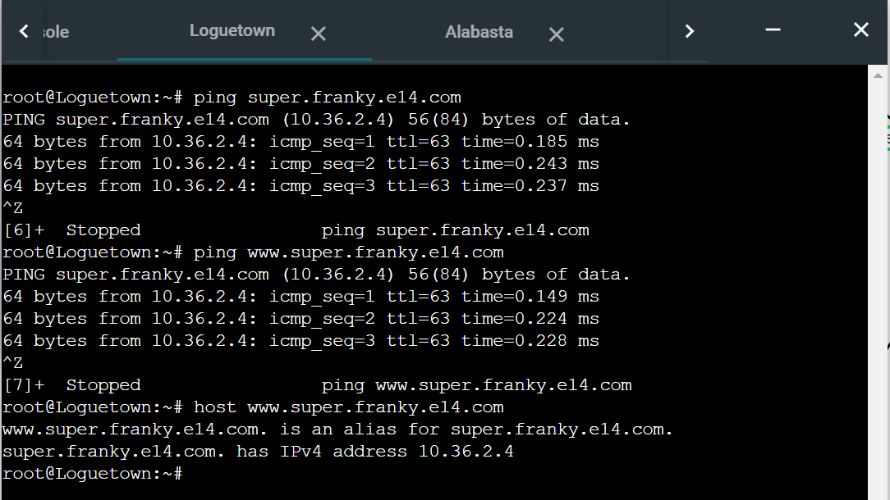

## Soal 4

Buat juga reverse domain untuk domain utama

**Pembahasan:**

1. Membuka file **named.conf.local** pada EniesLobby dengan perintah
   ```
   nano /etc/bind/named.conf.local
   ```
2. Lalu tambahkan konfigurasi berikut ke dalam file **named.conf.local**. Tambahkan reverse dari 3 byte awal dari IP yang ingin dilakukan Reverse DNS.
   ```
   zone "2.36.10.in-addr.arpa" {
      type master;
      file "/etc/bind/kaizoku/2.36.10.in-addr.arpa";
   };
   ```
   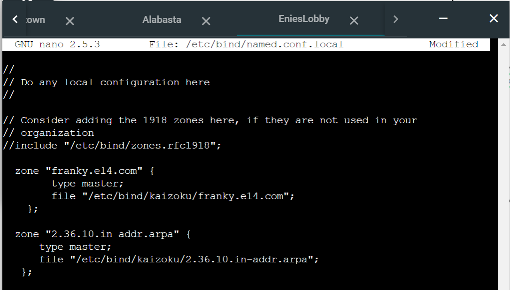
3. Copykan file db.local pada path /etc/bind ke dalam folder kaizoku yang baru saja dibuat dan ubah namanya menjadi **2.36.10.in-addr.arpa**
   ```
   cp /etc/bind/db.local /etc/bind/kaizoku/2.36.10.in-addr.arpa
   ```
4. Edit file **2.36.10.in-addr.arpa** menjadi seperti gambar di bawah ini
   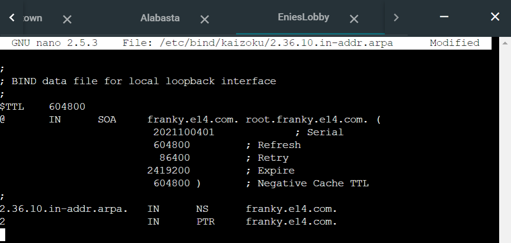
5. Kemudian restart bind9
   ```
   service bind9 restart
   ```
6. Untuk mengecek apakah konfigurasi sudah benar atau belum, lakukan perintah berikut pada client Alabasta dan Loguetown
   - Ubah nameserver pada file **/etc/resolv.conf** ke nameserver Foosha (192.168.122.1)
   ```
   nameserver 192.168.122.1
   #nameserver 10.36.2.2
   ```
   - Install package dnsutilts
   ```
   apt-get update
   apt-get install dnsutils
   ```
   - Kembalikan nameserver pada file **/etc/resolv.conf** ke nameserver EniesLobby
   ```
   #nameserver 192.168.122.1
   nameserver 10.36.2.2
   ```
   - Jalankan perintah berikut untuk memastikan konfigurasi sudah benar atau belum. IP yang digunakan adalah IP EniesLobby
   ```
   host -t PTR 10.36.2.2
   ```
7. Hasil dari konfigurasi pada Alabasta dan Loguetown
   a. Alabasta
   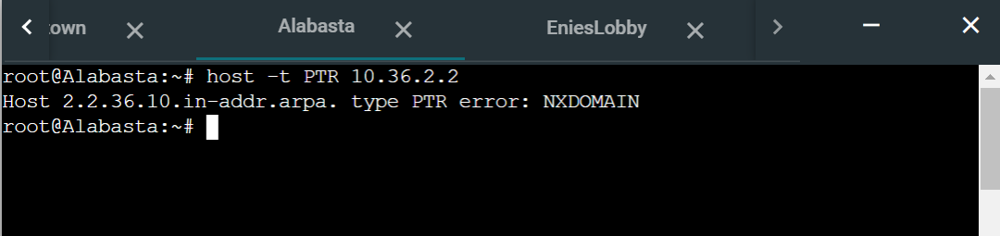
   b. Loguetown
   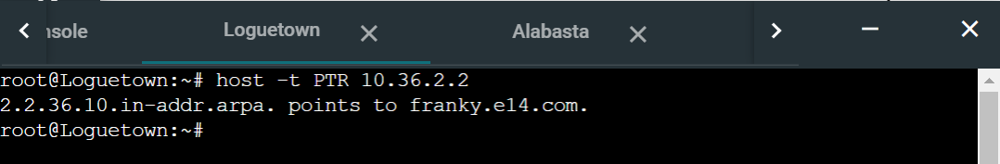

## Soal 5

Supaya tetap bisa menghubungi Franky jika server EniesLobby rusak, maka buat Water7 sebagai DNS Slave untuk domain utama

**Pembahasan:**

1. Edit file **/etc/bind/named.conf.local** pada EniesLobby dengan
   ```
   zone "franky.e14.com" {
      type master;
      notify yes;
      also-notify { 10.36.2.3; }; // Masukan IP Water7 tanpa tanda petik
      allow-transfer { 10.36.2.3; }; // Masukan IP Water7 tanpa tanda petik
      file "/etc/bind/kaizoku/franky.e14.com";
   };
   ```
   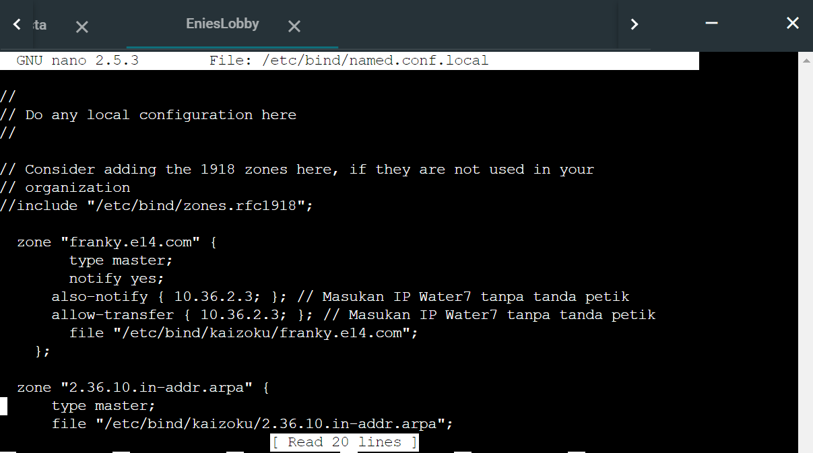
2. Lakukan restart bind9
   ```
   service bind9 restart
   ```
3. Membuka console Water7. Kemudian lakukan update dan install bind9
   ```
   apt-get update
   apt-get install bind9 -y
   ```
4. Kemudian buka file **/etc/bind/named.conf.local** pada Water7 dan tambahkan syntax berikut,
   ```
   zone "franky.e14.com" {
      type slave;
      masters { 10.36.2.2; }; // Masukan IP EniesLobby tanpa tanda petik
      file "/var/lib/bind/franky.e14.com";
   };
   ```
   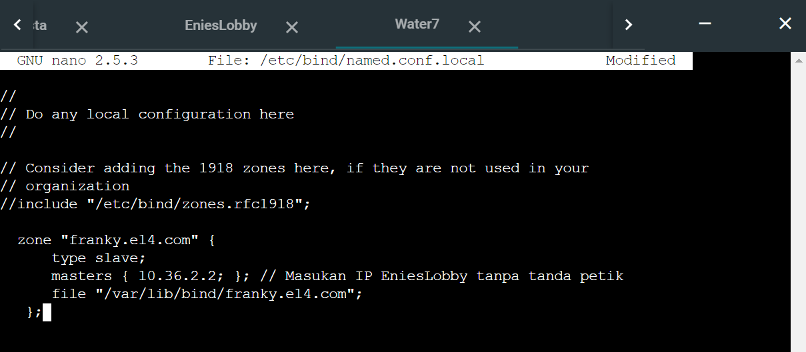
5. Lakukan restart bind9
   ```
   service bind9 restart
   ```
6. Untuk melakukan testing dapat dilakukan dengan
   - Matikan service bind9 pada EniesLobby
   ```
   service bind9 stop
   ```
   - Buka console Alabasta dan Loguetown. kemudian tambahkan nameserver Water7 pada file **/etc/resolv.conf**
   ```
   nameserver 10.36.2.2
   nameserver 10.36.2.3
   ```
   - Lakukan `ping franky.e14.com` pada Alabasta dan Loguetown

## Soal 6

Setelah itu terdapat subdomain mecha.franky.e14.com dengan alias www.mecha.franky.e14.com yang didelegasikan dari EniesLobby ke Water7 dengan IP menuju ke Skypie dalam folder sunnygo

**Pembahasan:**

1. Pada EniesLobby, edit file **/etc/bind/kaizoku/franky.e14.com** dan ubah menjadi seperti di bawah ini,
   ```
   nano /etc/bind/kaizoku/franky.e14.com
   ```
   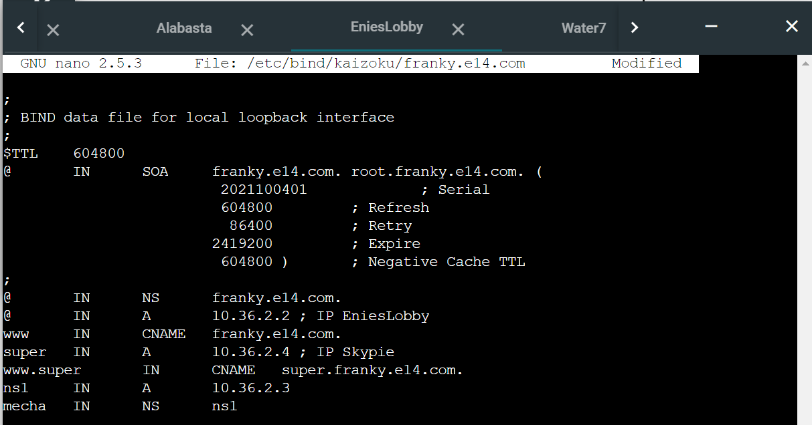
2. Kemudian edit file **/etc/bind/named.conf.options** pada EniesLobby.
   ```
   nano /etc/bind/named.conf.options
   ```
3. Setelah itu, comment `dnssec-validation auto;` dan tambahkan baris berikut pada **/etc/bind/named.conf.options**
   ```
   allow-query{any;};
   ```
4. Kemudian edit file **/etc/bind/named.conf.local** menjadi seperti gambar di bawah:
   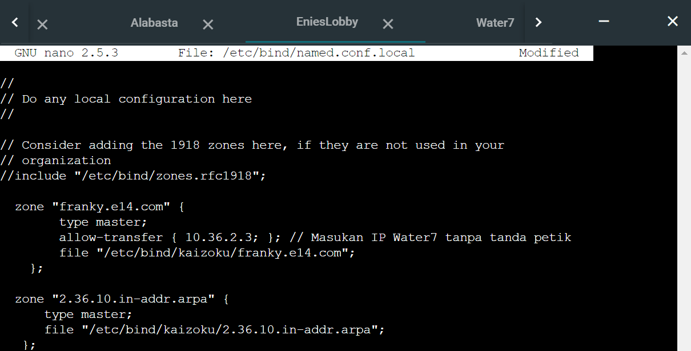
5. Lalu, restart bind9
   ```
   service bind9 restart
   ```
6. Pada console water7, edit file **/etc/bind/named.conf.options**
7. Kemudian comment `dnssec-validation auto;` dan tambahkan baris berikut pada **/etc/bind/named.conf.options**
   ```
   allow-query{any;};
   ```
8. Edit file **/etc/bind/named.conf.local** pada console Water7 menjadi seperti gambar di bawah
   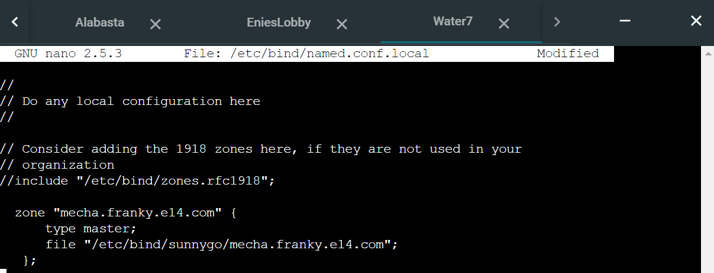
9. Kemudian buat direktori dengan nama **sunnygo** pada Water7
   ```
   mkdir /etc/bind/sunnygo
   ```
10. Copy db.local ke direktori **sunnygo** dan edit namanya menjadi `mecha.franky.e14.com`
    ```
    cp /etc/bind/db.local /etc/bind/sunnygo/mecha.franky.e14.com
    ```
11. Kemudian edit file mecha.franky.e14.com menjadi seperti dibawah ini
    ```
    nano /etc/bind/sunnygo/mecha.franky.e14.com
    ```
    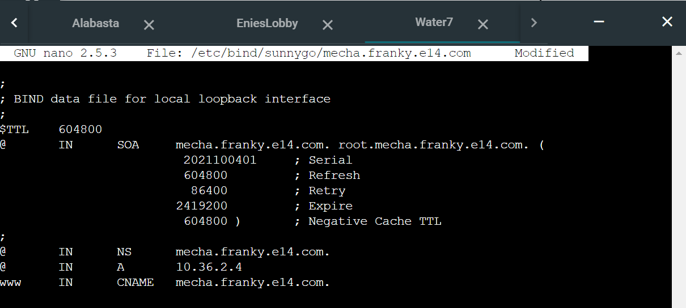
12. Restart bind9 di Water7

```
service bind9 restart
```

13. Lalu, dilakukan testing `ping mecha.franky.e14.com` dan `ping www.mecha.franky.e14.com` pada Alabasta dan Loguetown <br/>
    a. Alabasta
    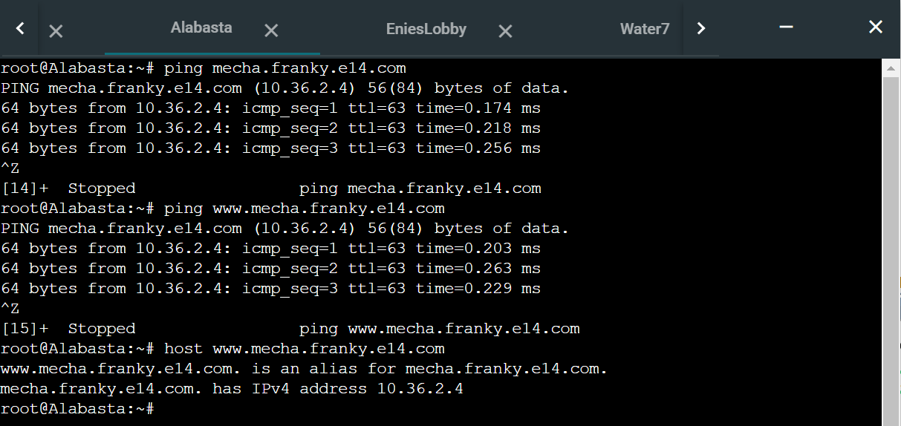
    b. Loguetown
    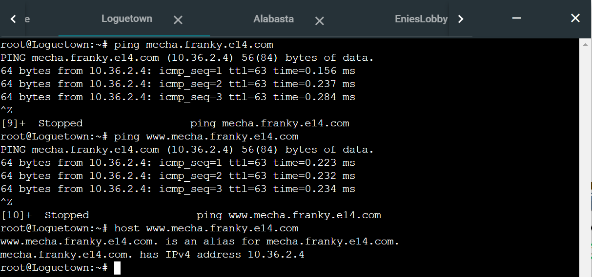

## Soal 7

Untuk memperlancar komunikasi Luffy dan rekannya, dibuatkan subdomain melalui Water7 dengan nama general.mecha.franky.e14.com dengan alias www.general.mecha.franky.e14.com yang mengarah ke Skypie

**Pembahasan:**

1. Edit file **/etc/bind/sunnygo/mecha.franky.e14.com** pada Water7, lalu tambahkan subdomain untuk mecha.franky.e14.com yang mengarah ke IP Skypie.
   ```
   nano /etc/bind/sunnygo/mecha.franky.e14.com
   ```
   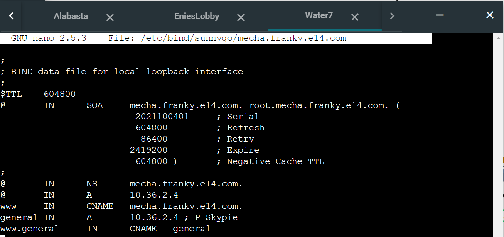
2. Restart service bind pada Water7 dan EniesLobby
   ```
   service bind9 restart
   ```
3. Lakukan testing `ping general.mecha.franky.e14.com` dan `wwww.general.mecha.franky.e14.com` pada Alabasta dan Loguetown <br/>
   a. Alabasta
   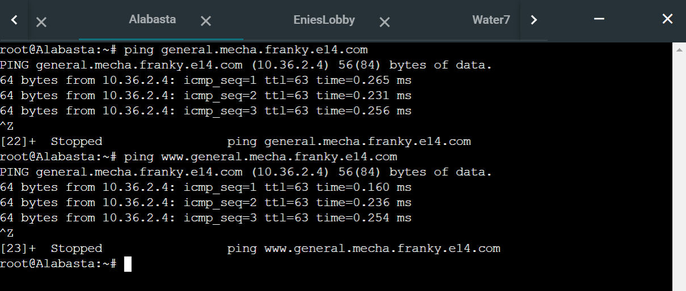

   b. Loguetown
   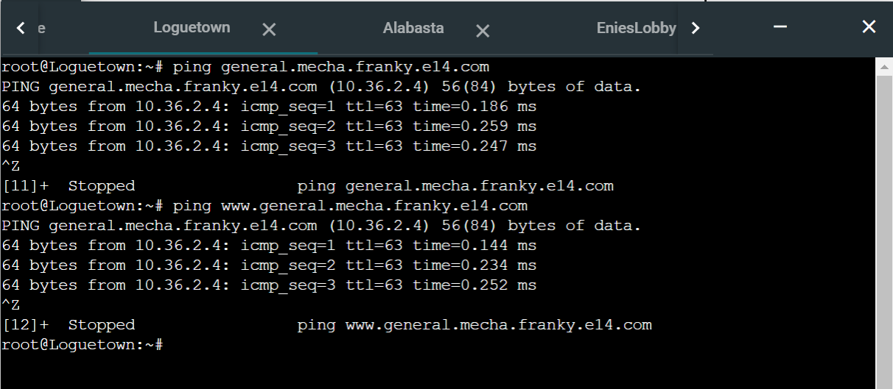

## Soal 8

Setelah melakukan konfigurasi server, maka dilakukan konfigurasi Webserver. Pertama dengan webserver www.franky.e14.com. Pertama, luffy membutuhkan webserver dengan DocumentRoot pada /var/www/franky.e14.com.

**Pembahasan:**

1. Install Lynx pada Loguetown dan Alabasta untuk testing web server.
   ```
   apt-get update
   apt-get install lynx
   ```
2. Install Apache2 pada EniesLobby untuk membuat web server.
   ```
   apt-get update
   apt-get install wget
   apt-get install apache2 -y
   apt-get install libapache2-mod-php7.0 -y
   apt-get install unzip
   ```
3. Copy file **/etc/apache2/sites-available/000-default.conf** untuk file konfigurasi website franky.e14.com.
   ```
   cp /etc/apache2/sites-available/000-default.conf /etc/apache2/sites-available/franky.e14.com.conf
   ```
4. Edit file **/etc/apache2/sites-available/franky.e14.com.conf** dan tambahkan konfigurasi berikut.
   ```
   ServerName franky.e14.com
   ServerAlias www.franky.e14.com
   DocumentRoot /var/www/franky.e14.com
   ```
   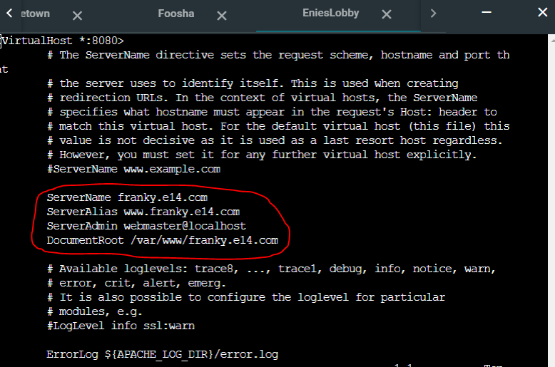
5. Aktifkan konfigurasi **franky.e14.com**.
   ```
   a2ensite franky.e14.com.conf
   ```
6. Download asset yang telah disediakan soal. Kemudian extract **franky.zip**.
   ```
   wget https://raw.githubusercontent.com/FeinardSlim/Praktikum-Modul-2-Jarkom/main/franky.zip
   unzip franky.zip
   mv franky /var/www/franky.e14.com
   ```
7. Lakukan restrart apache untuk menerapkan konfigurasi.
   ```
   service apache2 restart
   ```
8. Lakukan testing `lynx franky.e14.com` dan `lynx www.franky.e14.com` pada Alabasta atau Loguetown. <br>
   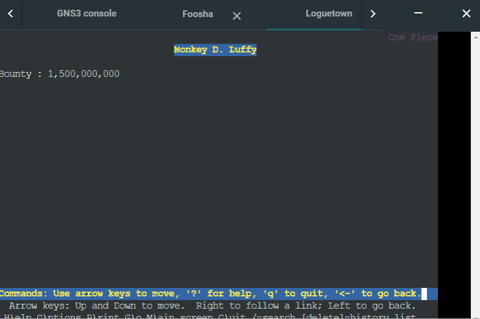

## Soal 9

Setelah itu, Luffy juga membutuhkan agar url www.franky.e14.com/index.php/home dapat menjadi menjadi www.franky.e14.com/home.

**Pembahasan:**

1. Edit file **/etc/apache2/sites-available/franky.e14.com.conf**, lalu tambahkan konfigurasi berikut.
   ```
   Alias "/home" "/var/www/franky.e14.com/index.php/home"
   ```
   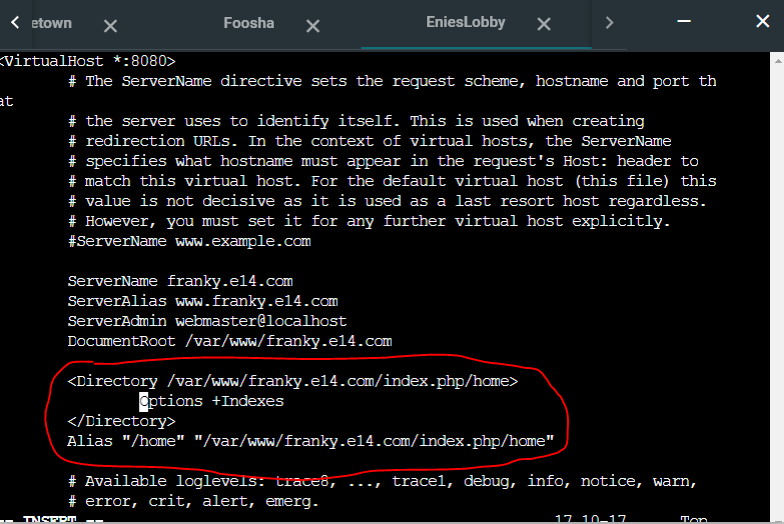
2. Lakukan restrart apache untuk menerapkan konfigurasi.
   ```
   service apache2 restart
   ```
3. Lakukan testing `lynx franky.e14.com/home` dan `lynx www.franky.e14.com/home` pada Loguetown. <br>
   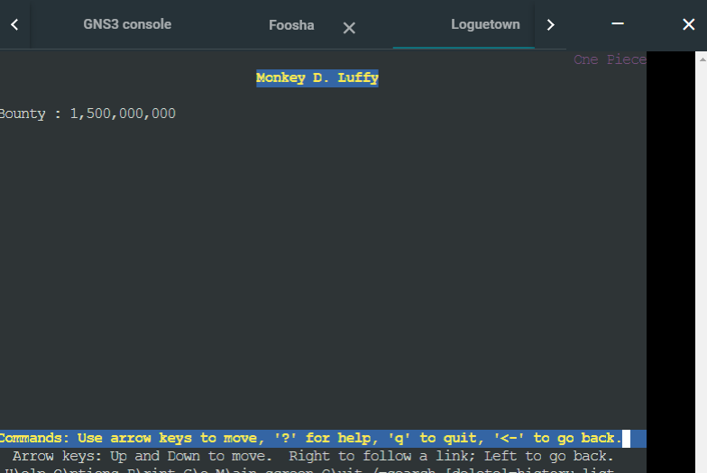

## Soal 10

Setelah itu, pada subdomain www.super.franky.e14.com, Luffy membutuhkan penyimpanan aset yang memiliki DocumentRoot pada /var/www/super.franky.e14.com.

**Pembahasan:**

1. Install Apache2 pada Skypie untuk membuat web server.
   ```
   apt-get update
   apt-get install wget -y
   apt-get install apache2 -y
   apt-get install libapache2-mod-php7.0 -y
   apt-get install unzip -y
   ```
2. Copy file **/etc/apache2/sites-available/000-default.conf** untuk file konfigurasi website super.franky.e14.com.
   ```
   cp /etc/apache2/sites-available/000-default.conf /etc/apache2/sites-available/super.franky.e14.com.conf
   ```
3. Edit file **/etc/apache2/sites-available/super.franky.e14.com.conf** dan tambahkan konfigurasi berikut.
   ```
   ServerName super.franky.e14.com
   ServerAlias www.super.franky.e14.com
   DocumentRoot /var/www/super.franky.e14.com
   ```
   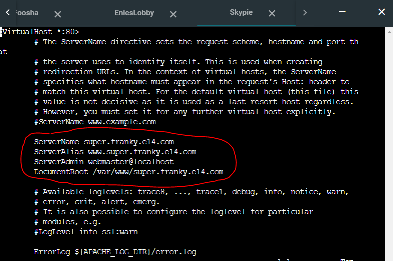
4. Aktifkan konfigurasi **super.franky.e14.com**.
   ```
   a2ensite super.franky.e14.com.conf
   ```
5. Download asset yang telah disediakan soal. Kemudian extract **super.franky.zip**.
   ```
   wget https://raw.githubusercontent.com/FeinardSlim/Praktikum-Modul-2-Jarkom/main/super.franky.zip
   unzip super.franky.zip
   mv super.franky /var/www/super.franky.e14.com
   ```
6. Lakukan restrart apache untuk menerapkan konfigurasi.
   ```
   service apache2 restart
   ```
7. Lakukan testing `lynx super.franky.e14.com` dan `lynx www.super.franky.e14.com` pada Alabasta atau Loguetown. <br>
   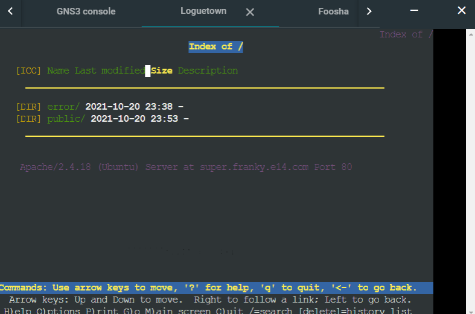

## Soal 11

Akan tetapi, pada folder /public, Luffy ingin hanya dapat melakukan directory listing saja.

**Pembahasan:**

1. Edit file **/etc/apache2/sites-available/super.franky.e14.com.conf**, lalu tambahkan konfigurasi berikut.
   ```
   <Directory /var/www/super.franky.e14.com/public>
      Options +Indexes
   </Directory>
   ```
   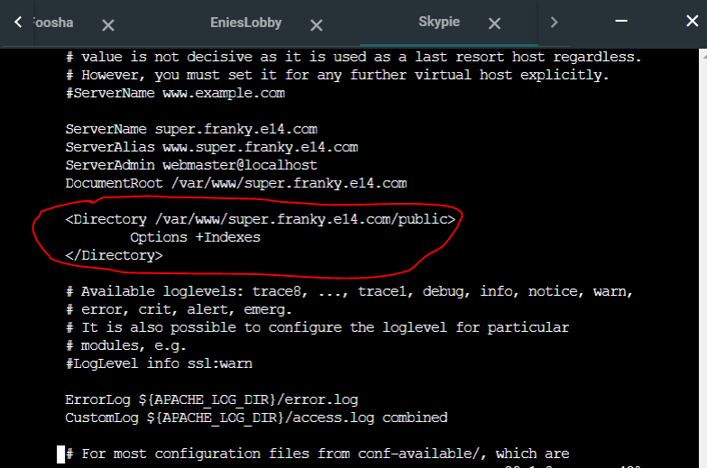
2. Lakukan restrart apache untuk menerapkan konfigurasi.
   ```
   service apache2 restart
   ```
3. Lakukan testing `lynx super.franky.e14.com/public` dan `lynx www.super.franky.e14.com/public` pada Loguetown. <br>
   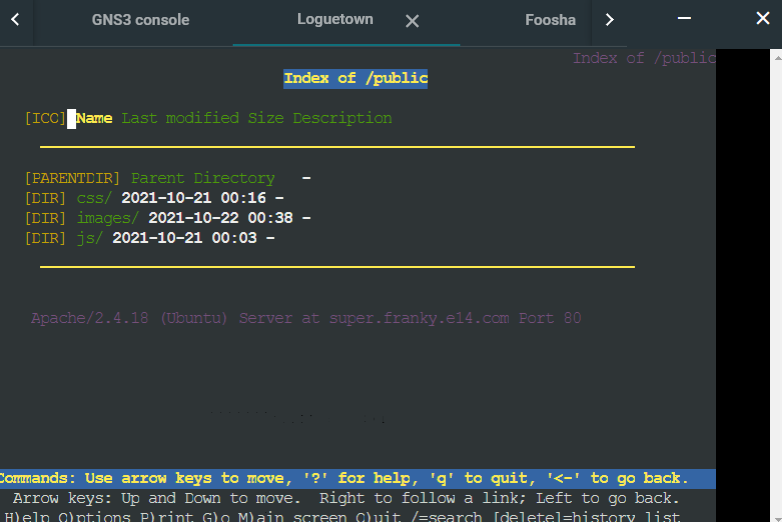

## Soal 12

Tidak hanya itu, Luffy juga menyiapkan error file 404.html pada folder /error untuk mengganti error kode pada apache.

**Pembahasan:**

1. Edit file **/etc/apache2/sites-available/super.franky.e14.com.conf**, lalu tambahkan konfigurasi berikut.
   ```
   ErrorDocument 404 /error/404.html
   ```
   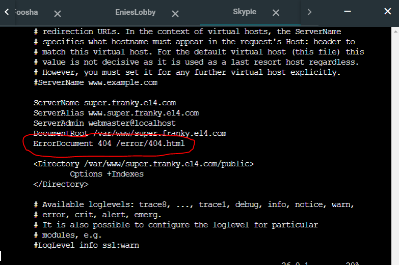
2. Lakukan restrart apache untuk menerapkan konfigurasi.
   ```
   service apache2 restart
   ```
3. Lakukan testing `lynx super.franky.e14.com/404` dan `lynx www.super.franky.e14.com/404` pada Loguetown. <br>
   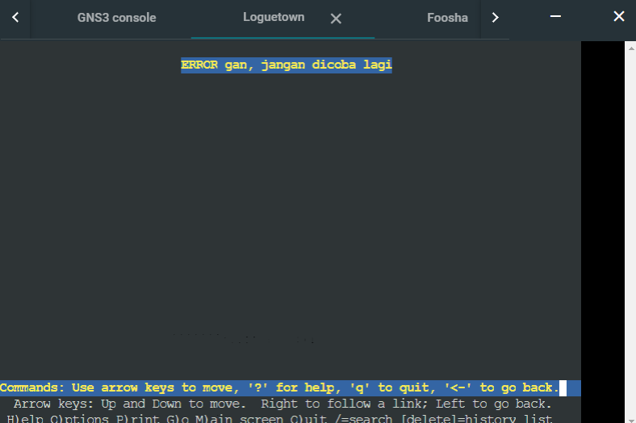

## Soal 13

Luffy juga meminta Nami untuk dibuatkan konfigurasi virtual host. Virtual host ini bertujuan untuk dapat mengakses file asset www.super.franky.e14.com/public/js menjadi www.super.franky.e14.com/js.

**Pembahasan:**

1. Edit file **/etc/apache2/sites-available/super.franky.e14.com.conf**, lalu tambahkan konfigurasi berikut.
   ```
   <Directory /var/www/super.franky.e14.com/public/js>
      Options +Indexes
   </Directory>
   Alias "/js" "/var/www/super.franky.e14.com/public/js"
   ```
   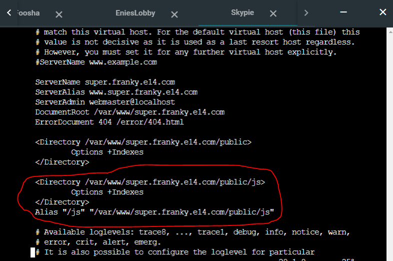
2. Lakukan restrart apache untuk menerapkan konfigurasi.
   ```
   service apache2 restart
   ```
3. Lakukan testing `lynx super.franky.e14.com/js` dan `lynx www.super.franky.e14.com/js` pada Loguetown. <br>
   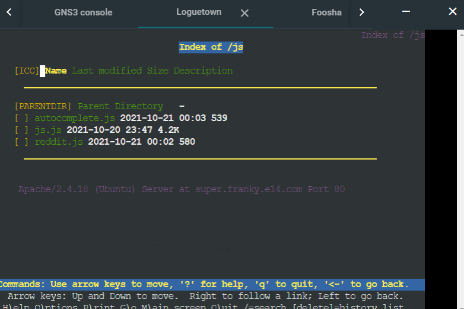

## Soal 14

Dan Luffy meminta untuk web www.general.mecha.franky.e14.com hanya bisa diakses dengan port 15000 dan port 15500.

**Pembahasan:**

1. Pada Skypie, copy file **/etc/apache2/sites-available/000-default.conf** untuk file konfigurasi website general.mecha.franky.e14.com.
   ```
   cp /etc/apache2/sites-available/000-default.conf /etc/apache2/sites-available/general.mecha.franky.e14.com.conf
   ```
2. Edit file **/etc/apache2/ports.conf** dan tambahkan port 15000 dan port 15500.
   ```
   Listen 15000
   Listen 15500
   ```
   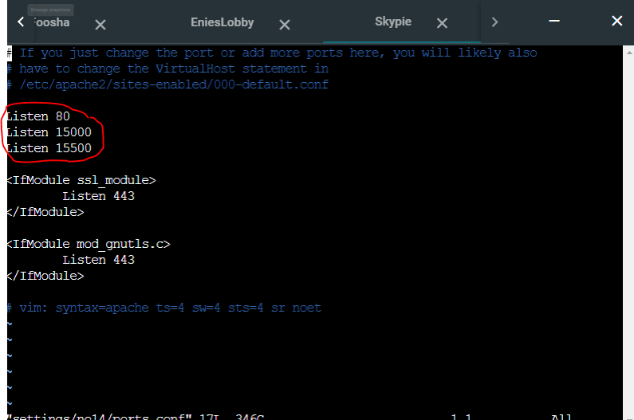
3. Edit file **/etc/apache2/sites-available/general.mecha.franky.e14.com.conf** dan tambahkan konfigurasi berikut.
   ```
   <VirtualHost *:15000 *:15500>
   ...
   ServerName general.mecha.franky.e14.com
   ServerAlias www.general.mecha.franky.e14.com
   DocumentRoot /var/www/general.mecha.franky.e14.com
   ```
   
4. Aktifkan konfigurasi **general.mecha.franky.e14.com**.
   ```
   a2ensite general.mecha.franky.e14.com.conf
   ```
5. Download asset yang telah disediakan soal. Kemudian extract **general.mecha.franky.zip**.
   ```
   wget https://raw.githubusercontent.com/FeinardSlim/Praktikum-Modul-2-Jarkom/main/general.mecha.franky.zip
   unzip general.mecha.franky.zip
   mv general.mecha.franky /var/www/general.mecha.franky.e14.com/
   ```
6. Lakukan restrart apache untuk menerapkan konfigurasi.
   ```
   service apache2 restart
   ```
7. Lakukan testing `lynx general.mecha.franky.e14.com:15000` dan `lynx general.mecha.franky.e14.com:15500` pada Alabasta atau Loguetown. <br>
   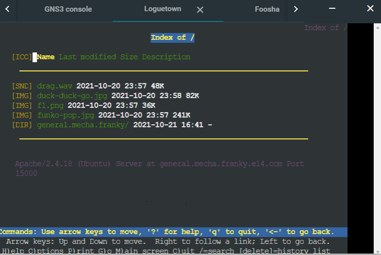

## Soal 15

Dengan autentikasi username luffy dan password onepiece dan file di /var/www/general.mecha.franky.e14.

**Pembahasan:**

1. Edit file **/etc/apache2/sites-available/general.mecha.franky.e14.com.conf**, lalu tambahkan konfigurasi berikut.
   ```
   <Directory /var/www/general.mecha.franky.e14.com>
      AuthType Basic
      AuthName "Private"
      AuthUserFile /etc/apache2/.htpasswd
      Require valid-user
   </Directory>
   ```
   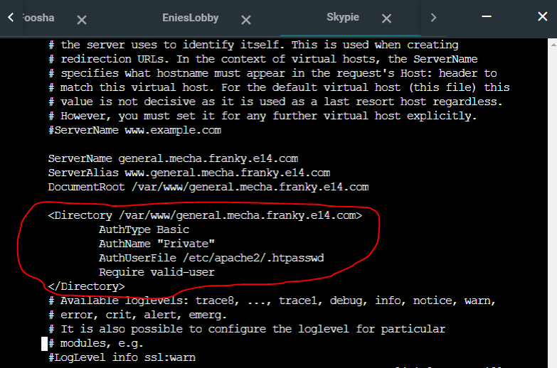
2. Jalankan command beikut yang berarti ingin membuat akun autentikasi baru dengan username **luffy**. Masukkan password baru dan confirm password tersebut dengan **onepiece**.
   ```
   htpasswd -c /etc/apache2/.htpasswd luffy
   ```
3. Lakukan restrart apache untuk menerapkan konfigurasi.
   ```
   service apache2 restart
   ```
4. Lakukan testing `lynx general.mecha.franky.e14.com` dan `lynx wwww.general.mecha.franky.e14.com` pada Alabasta atau Loguetown. <br>
   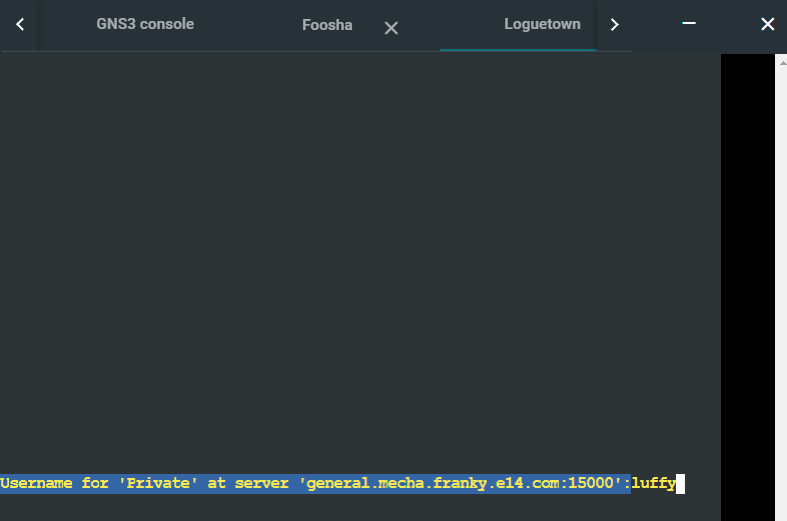
   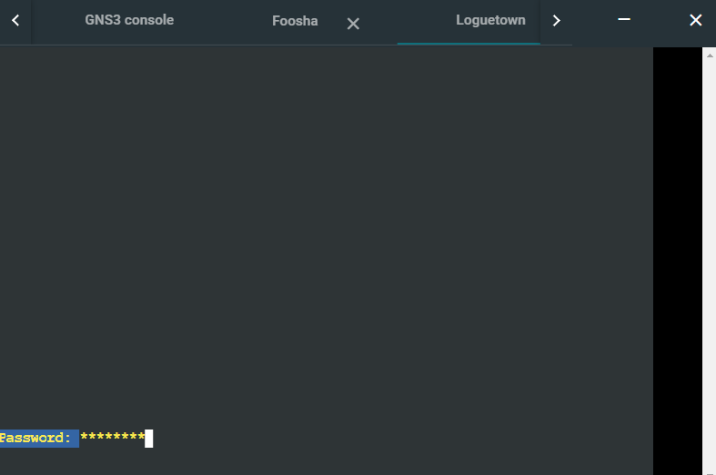
   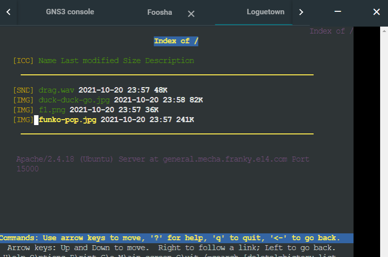

## Soal 16

Dan setiap kali mengakses IP Skypie akan dialihkan secara otomatis ke www.franky.yyy.com.
**Pembahasan:**

1. Tambahkan file ```000-default.conf``` pada ```/root/settings/no16/```, kemudian tuliskan konfigurasi berikut.
```
<VirtualHost *:80>
        ServerAdmin webmaster@localhost
        DocumentRoot /var/www/html

        RewriteEngine On
        RewriteCond %{HTTP_HOST} !^franky.e14.com$
        RewriteRule /.* http://franky.e14.com/ [R]

        ErrorLog ${APACHE_LOG_DIR}/error.log
        CustomLog ${APACHE_LOG_DIR}/access.log combined
</VirtualHost>
```

2. Kemudian buat file script bash ```no16.sh``` pada ```/root/settings/no16/```, dengan perintah sebagai berikut.
```
cp /root/settings/no16/000-default.conf /etc/apache2/sites-available/000-default.conf

a2enmod rewrite
service apache2 restart
```

3. Lalu jalankan script dengan mengetik pada terminal ```bash settings/no16/no16.sh````.
4. Kemudian cek apakah IP Skypie sudah di redirect ke ```franky.e14.com```.


## Soal 17

Dikarenakan Franky juga ingin mengajak temannya untuk dapat menghubunginya melalui website www.super.franky.yyy.com, dan dikarenakan pengunjung web server pasti akan bingung dengan randomnya images yang ada, maka Franky juga meminta untuk mengganti request gambar yang memiliki substring “franky” akan diarahkan menuju franky.png.

**Pembahasan:**

1. Edit file **/etc/apache2/sites-available/super.franky.e14.com.conf**, lalu tambahkan konfigurasi berikut.
   ```
   <Directory /var/www/super.franky.e14.com>
      Options +Indexes +FollowSymLinks -MultiViews
      AllowOverride All
   </Directory>
   ```
   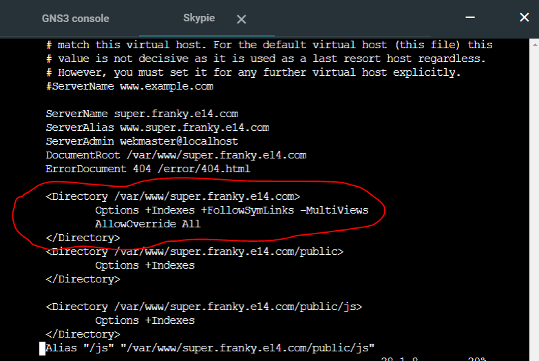
2. Jalan kan `a2enmod rewrite` untuk mengaktifkan mod rewrite. Kemudian buat file **/var/www/seper.franky.e14.com/.htaccess" dengan menambahkan config berikut.
   ```
   RewriteEngine On
   RewriteCond %{REQUEST_URI} ^/public/images/(.*)franky(.*)
   RewriteCond %{REQUEST_URI} !/public/images/franky.png
   RewriteRule /.* http://super.franky.e14.com/public/images/franky.png [L]
   ```
3. Lakukan restrart apache untuk menerapkan konfigurasi.
   ```
   service apache2 restart
   ```
4. Lakukan testing `lynx super.franky.e14.com/public/images/punkyfranky.png` pada Loguetown. <br>
   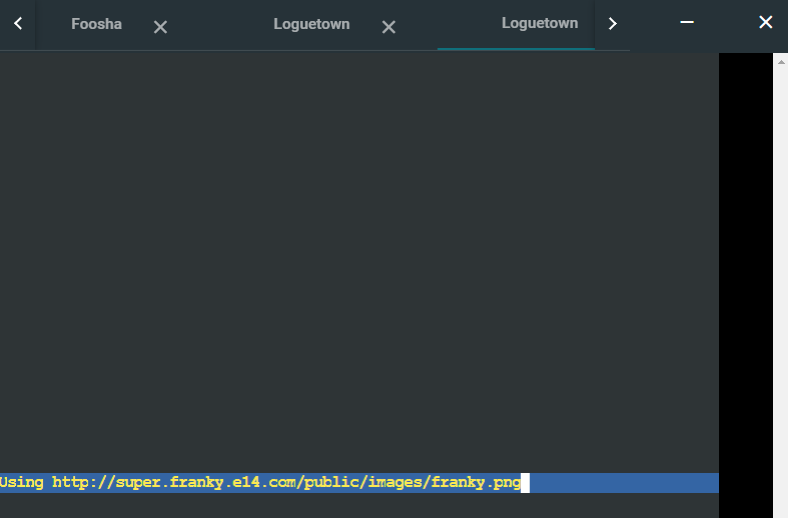
